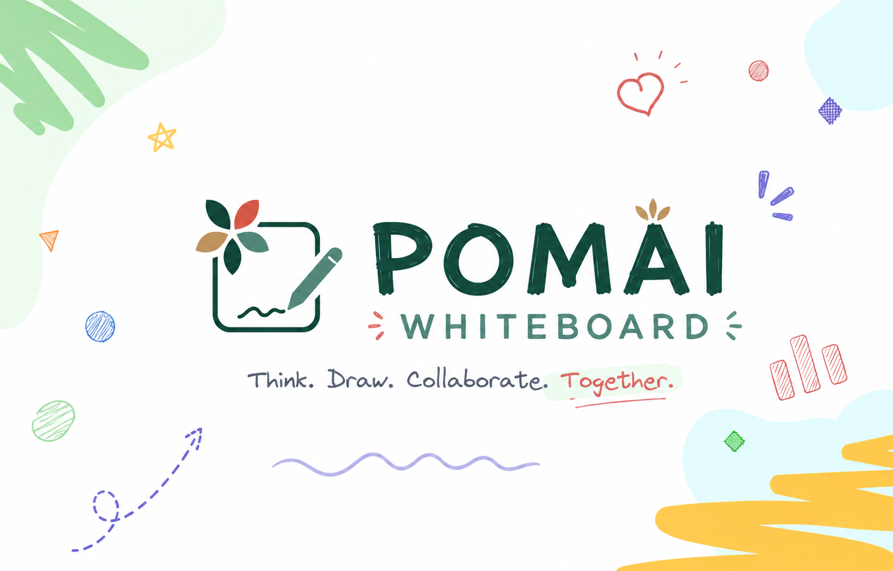

<div align="center">
  

  <h1>✨ Pomai Whiteboard</h1>
  <p><b>Next-Generation High-Performance Collaborative Whiteboard with C++ WASM Acceleration & Glassmorphism Design System</b></p>

  <p>
    <a href="https://github.com/pomagrenate/pomaiwhiteboard/blob/master/LICENSE">
      
    </a>
    <a href="https://github.com/pomagrenate/pomaiwhiteboard">
      
    </a>
    <a href="https://github.com/pomagrenate/pomaiwhiteboard">
      
    </a>
  </p>
</div>

---

## 🚀 Overview

**Pomai Whiteboard** is an enterprise-grade, high-performance virtual canvas built for modern teams and visual engineering. Re-engineered from the ground up, Pomai Whiteboard combines a sleek, modern **Glassmorphism UI** with a custom **C++ WebAssembly (`po_render`)** engine for hardware-accelerated 2D math, spatial indexing, SIMD flood fills, and complex geometry pathfinding.

---

## 🔥 Key Features

### 🎨 Modern Glassmorphism UI & Floating Dock Architecture
- **Floating Tool Dock**: Pill-shaped floating control bar with dynamic visual glows and stateful feedback.
- **Unified Header**: Integrated document management, menu navigation, and collaborative user presence.
- **Glassmorphism Design Tokens**: Ambient backdrop blur filters, sleek translucent surfaces, and custom violet design accents (`#7C3AED`).

### ⚡ C++ WebAssembly SIMD Acceleration (`po_render`)
- **SIMD-Accelerated Flood Fill**: Near-instantaneous pixel calculations running directly on WebAssembly memory.
- **Spatial Indexing & R-Tree Querying**: Accelerated element collision, raycasting, and selection hit-testing.
- **Elbow Arrow Pathfinding**: Dynamic obstacle-avoiding connector routing computed natively in C++.
- **Scene Graph Transformation**: Fast matrix transformations and path generation for smooth infinite-canvas panning and zooming.

### 📦 Ecosystem & Native Standards
- **Native `.pomaiwhiteboard` Canvas**: Encrypted open data format for vector canvas storage.
- **Native `.pomailib` Library Support**: Seamless component sharing and custom vector library imports.
- **Local-First & Offline Ready**: Instant auto-saving with offline PWA support.

---

## 🛠️ Monorepo Package Architecture

Pomai Whiteboard is structured as a modular TypeScript/C++ monorepo:

| Package | Description |
| :--- | :--- |
| `packages/po_render` | Core C++ rendering engine compiled to WebAssembly with Emscripten SIMD support |
| `packages/element` | Canvas element definitions, WASM bridge loaders, and scene graph logic |
| `packages/pomaiwhiteboard` | React components, UI layer, floating docks, and theme styling |
| `pomaiwhiteboard-app` | Production web application entry point & dev server |

---

## 🏁 Quick Start Guide

### Prerequisites
- **Node.js**: `>= 18.0.0`
- **Yarn**: `1.22.x`
- **Emscripten** *(Optional, required only for rebuilding C++ WASM sources)*

### Installation & Running Locally

1. **Clone the repository**:
   ```bash
   git clone https://github.com/pomagrenate/pomaiwhiteboard.git
   cd pomaiwhiteboard/frontend
   ```

2. **Install dependencies**:
   ```bash
   yarn install
   ```

3. **Build monorepo packages**:
   ```bash
   yarn build:packages
   ```

4. **Start local development server**:
   ```bash
   yarn start
   ```
   Open `http://localhost:3002/` in your browser.

---

## 🐳 Docker Deployment

To build and run the production container:

```bash
# Build the single-stage Docker container
docker build -t pomaiwhiteboard:latest .

# Run the container on port 80
docker run -d -p 80:80 pomaiwhiteboard:latest
```

---

## 📄 License

Pomai Whiteboard is released under the [MIT License](LICENSE).

